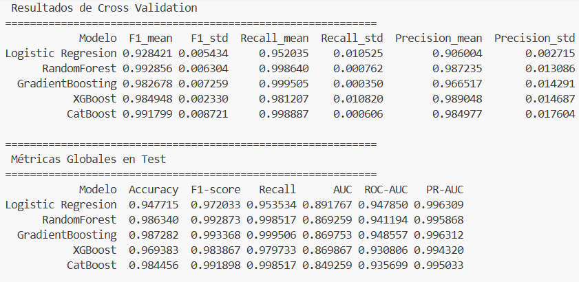
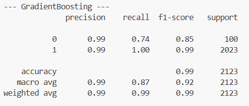
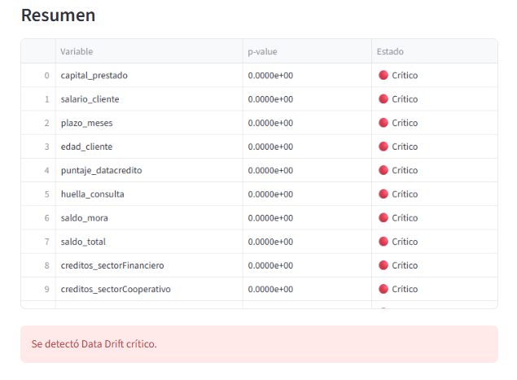
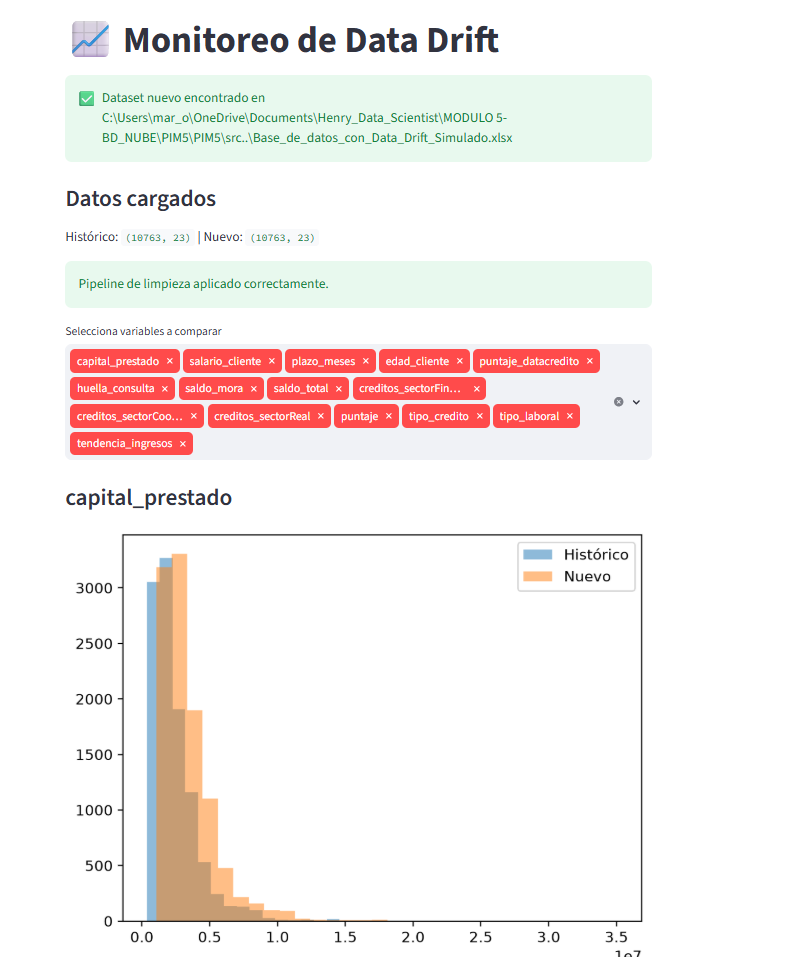
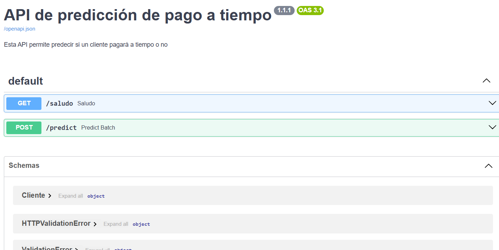
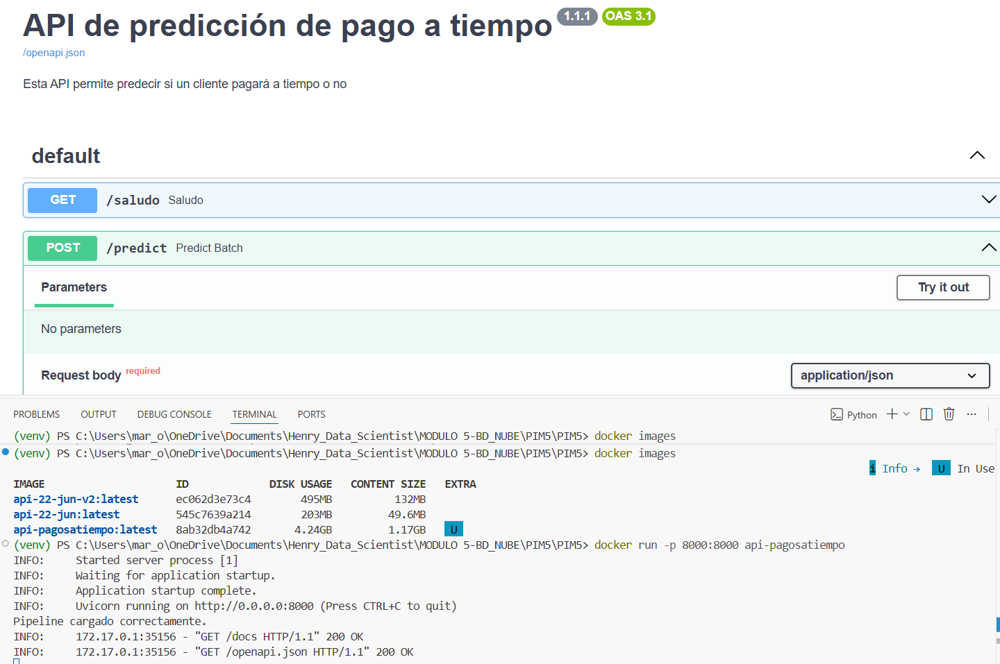

# 📌 Predicción de Pago a Tiempo de Clientes

## 📖 Descripción

Este proyecto desarrolla un modelo de Machine Learning para predecir si un cliente realizará el pago de su crédito a tiempo. Esta capacidad de predicción permite a las entidades anticipar riesgos de cartera vencida, optimizar estrategias de cobranza y tomar decisiones más informadas sobre la aprobación de nuevos créditos. En términos de negocio, un modelo predictivo confiable ayuda a reducir pérdidas, mejorar la gestión del riesgo y aumentar la sostenibilidad financiera.

El proyecto implementa un flujo completo de Machine Learning, desde la limpieza y preprocesamiento de los datos hasta el despliegue del modelo mediante una API REST con FastAPI, el monitoreo de Data Drift mediante Streamlit y la contenerización con Docker.

---

# 🎯 Objetivos

- Desarrollar un modelo de clasificación para predecir el pago oportuno de un crédito.
- Construir un pipeline de limpieza y preprocesamiento reutilizable.
- Comparar diferentes algoritmos de clasificación.
- Seleccionar el modelo con mejor desempeño para la clase minoritaria.
- Desplegar el modelo mediante una API REST.
- Implementar monitoreo de Data Drift.
- Contenerizar la aplicación utilizando Docker.

---

# 📂 Estructura del proyecto

```text
PIM5/
│
│
├── models/
│   └── model.pkl
│
├── src/
│   ├── cargar_datos.py
│   ├── custom_transformers.py
│   ├── ft_engineering.py
│   ├── model_training_evaluation.py
│   ├── model_deploy.py
│   └── model_monitoring.py
│
── images/
│   ├── API_Prediccion.png
│   ├── Classification_Report_GB.png
│   ├── Estadisticos_Datadrift.png
│   ├── Metricas_modelos.png
│   ├── Streamlit_datadrift.png
│   └── model_monitoring.py
│
├──Base_de_datos.xlsx
├──Base_de_datos_con_Data_Drift_Simulado.xlsx
├── Dockerfile
├── requirements.txt
├── README.md
├── LICENSE
└── .gitignore
```

---

# ⚙️ Tecnologías utilizadas

- Python
- Pandas
- NumPy
- Scikit-Learn
- CatBoost
- XGBoost
- FastAPI
- Streamlit
- Plotly
- Docker
- Joblib

---

# 🔄 Flujo del proyecto

```text
Datos
    │
    ▼
Limpieza
(CustomCleaner)
    │
    ▼
Imputación
(SimpleImputer)
    │
    ▼
Preprocesamiento
(ColumnTransformer)
    │
    ▼
Entrenamiento
    │
    ▼
Selección del mejor modelo
    │
 ┌──┴───────────────┐
 ▼                  ▼
Pipeline        Streamlit
de inferencia   Data Drift
    │
    ▼
FastAPI        
Predicción     
```
---
# Datos utilizados
El dataset original contenía 10.763 registros con información crediticia de clientes, que incluye tanto variables numéricas como categóricas. Entre las más relevantes se encuentran edad del cliente, tipo de crédito, capital prestado, salario, plazo en meses, puntaje de riesgo, historial de consultas y tendencia de ingresos. La variable objetivo es Pago_atiempo, que indica si el cliente cumplió con sus obligaciones en el plazo acordado. El dataset original presentaba valores faltantes, inconsistencias y un marcado desbalance entre clases (95 % pagos a tiempo vs. 5 % incumplimientos). Por ello, se aplicaron procesos de limpieza, imputación y normalización para garantizar la calidad de los datos antes del entrenamiento del modelo.

La siguiente tabla muestra las variables que contiene el dataset original y su uso en el modelo:

| Variable | Tipo | Descripción | Uso en el modelo |
| --- | --- | --- | --- |
| **tipo_credito** | Categórica | Tipo de producto crediticio solicitado por el cliente. | ✅ Incluida |
| **fecha_prestamo** | Fecha | Fecha en que se otorgó el crédito. | ❌ Excluida (no relevante para predicción) |
| **capital_prestado** | Numérica | Monto total del crédito otorgado. | ✅ Incluida |
| **plazo_meses** | Numérica | Duración del crédito en meses. | ✅ Incluida |
| **edad_cliente** | Numérica | Edad del cliente en años. | ✅ Incluida |
| **tipo_laboral** | Categórica | Situación laboral del cliente (Empleado, Independiente, etc.). | ✅ Incluida |
| **salario_cliente** | Numérica | Ingreso mensual reportado por el cliente. | ✅ Incluida |
| **total_otros_prestamos** | Numérica | Número de otros préstamos activos del cliente. | ❌ Excluida (baja correlación con objetivo) |
| **cuota_pactada** | Numérica | Valor de la cuota mensual pactada. | ❌ Excluida (alta correlación con saldo_principal) |
| **puntaje** | Numérica | Puntaje interno calculado por la entidad. | ✅ Incluida |
| **puntaje_datacredito** | Numérica | Puntaje de riesgo crediticio externo. | ✅ Incluida |
| **cant_creditosvigentes** | Numérica | Número total de créditos vigentes. | ❌ Excluida (redundante con otras variables sectoriales) |
| **huella_consulta** | Numérica | Número de consultas recientes en centrales de riesgo. | ✅ Incluida |
| **saldo_mora** | Numérica | Valor acumulado en mora al momento del análisis. | ✅ Incluida |
| **saldo_total** | Numérica | Total de obligaciones financieras vigentes. | ✅ Incluida |
| **saldo_principal** | Numérica | Saldo principal pendiente del crédito. | ❌ Excluida (alta correlación con cuota_pactada) |
| **saldo_mora_codeudor** | Numérica | Valor en mora asociado a codeudores. | ❌ Excluida (baja correlación con objetivo) |
| **creditos_sectorFinanciero** | Numérica | Número de créditos activos en el sector financiero. | ✅ Incluida |
| **creditos_sectorCooperativo** | Numérica | Número de créditos activos en el sector cooperativo. | ✅ Incluida |
| **creditos_sectorReal** | Numérica | Número de créditos activos en el sector real. | ✅ Incluida |
| **promedio_ingresos_datacredito** | Numérica | Promedio de ingresos reportados en centrales de riesgo. | ❌ Excluida (alta cantidad de nulos y baja correlación) |
| **tendencia_ingresos** | Categórica | Tendencia declarada de ingresos del cliente (Estable, Creciente, etc.). | ✅ Incluida |
| **Pago_atiempo** | Binaria | Variable objetivo: 1 si el cliente paga a tiempo, 0 si incumple. | 🎯 Objetivo |

Algunas inconsistencias que se identificaron: 
* Registros de clientes con edades mayores a 100 años y que además presentan otras inconsistencias donde se tienen valores muy altos en la variable "Total_otros_prestamos" pero se tienen puntajes de 0 en datacrédito, los valores de saldo total y saldo principal se encuentran vacios y el número de creditos en todos los sectores es 0, teniendo en cuenta que estos registros representan el 1.4% del total, se opta por no tenerlos en cuenta en entrenamiento para evitar introducir ruido e incertidumbre a los modelos de predicción.

* Se identifican valores númericos en la columna tendencia_ingresos que corresponde a una variable categórica
* Se identifica un registro en la variable "tipo_credito" con un valor outlier, por lo que tampoco se tiene en cuenta en el entrenamiento de modelos

El dataset original contenía 22 variables con información demográfica, financiera y crediticia de los clientes. Durante el análisis exploratorio se identificaron variables altamente correlacionadas entre sí, como cuota_pactada y saldo_principal, que fueron descartadas para evitar redundancia en el modelo. Asimismo, se eliminaron variables con baja correlación respecto a la variable objetivo, como total_otros_prestamos y saldo_mora_codeudor, dado que no aportaban valor predictivo significativo. Finalmente, se descartó promedio_ingresos_datacredito debido a su alta proporción de valores nulos y baja relación con el pago oportuno. De esta manera, se seleccionaron únicamente las variables más relevantes y consistentes para el entrenamiento del modelo, garantizando un mejor desempeño y evitando sobreajuste.

# Limpieza y preprocesamiento
para la limpieza y preprocesamiento se desarrollaron los pipelines que abarcan las siguientes actividades:
| Etapa                 | Descripción                                                                                                                                           |
| --------------------- | ----------------------------------------------------------------------------------------------------------------------------------------------------- |
| **Limpieza de datos** | Corrección de valores inconsistentes, tratamiento de valores faltantes mediante imputación y estandarización de variables antes del entrenamiento.    |
| **Preprocesamiento**  | Escalado de variables numéricas con `StandardScaler` y codificación de variables categóricas mediante `OneHotEncoder` utilizando `ColumnTransformer`. |

---
# Manejo de desbalanceo de clases
En el dataset, la variable objetivo presentaba un desbalance significativo (aproximadamente 95 % de la clase positiva frente a 5 % de la clase negativa). Para evitar que los modelos se sesgaran hacia la clase mayoritaria, se aplicaron diferentes estrategias de balanceo:
* En la división de datos en entrenamiento y testeo, se aplico el parámetros stratify = y, para asegurar que la proporción de clases de la variable objetivo (y), se mantenga tanto en el grupo de entrenamiento y como en el de testeo.
* SMOTE (Synthetic Minority Oversampling Technique):  
Se generaron muestras sintéticas de la clase minoritaria para equilibrar la proporción de clases en el conjunto de entrenamiento. Esto permitió que los algoritmos tuvieran más ejemplos representativos de la clase minoritaria y mejoraran métricas como recall y F1-score.

* Class Weights en modelos lineales y de ensamble:  
En modelos como Logistic Regression y Random Forest, se utilizó el parámetro class_weight="balanced". Esto ajusta automáticamente los pesos de cada clase en función de su frecuencia, penalizando más los errores en la clase minoritaria.

* Scale_pos_weight en XGBoost:  
Se configuró el parámetro scale_pos_weight para reflejar la proporción entre clases (5/95). Esto ayuda al algoritmo a dar mayor importancia a la clase minoritaria durante el entrenamiento.

* Auto_class_weights en CatBoost:  
Se empleó la opción auto_class_weights='Balanced', que ajusta internamente los pesos de las clases para compensar el desbalance.
---

# 🤖 Modelos evaluados

Durante el desarrollo se evaluaron diferentes modelos de clasificación:

- Logistic Regression
- Random Forest
- Gradient Boosting
- XGBoost
- CatBoost

La evaluación se realizó con validación cruzada y métricas como Accuracy, Recall, F1-score, ROC-AUC y PR-AUC.

La selección del modelo se realizó priorizando el desempeño sobre la clase minoritaria (clientes que no realizan el pago oportunamente); Dado que el conjunto de datos presenta un desbalance entre clases, la evaluación de los modelos no se limitó a métricas globales como Accuracy o ROC-AUC. Se realizó un análisis detallado del Classification Report, prestando especial atención al comportamiento sobre la clase 0, correspondiente a los clientes que no realizan el pago a tiempo, ya que representa el escenario de mayor interés para el negocio.







Estos resultados muestran que el modelo identifica correctamente el 74 % de los clientes pertenecientes a la clase minoritaria, manteniendo simultáneamente una precisión del 99 %. En otras palabras, cuando el modelo clasifica a un cliente como perteneciente a la clase de menor riesgo (clase mayoritaria), prácticamente todas esas predicciones son correctas.

El F1-score de 0.85 para la clase minoritaria refleja un buen equilibrio entre precisión y capacidad de detección, aspecto especialmente importante en problemas con clases desbalanceadas.

Aunque durante la comparación algunos modelos alcanzaron un recall ligeramente superior para la clase 0, estos lo hicieron a costa de reducir significativamente la precisión, generando un mayor número de falsos positivos. En particular, Logistic Regression presentó un recall competitivo para la clase minoritaria, pero una precisión cercana al 47 %, lo que implica que más de la mitad de los clientes clasificados como de alto riesgo realmente pertenecían a la clase mayoritaria.

Por esta razón, Gradient Boosting fue seleccionado como modelo final, al ofrecer el mejor equilibrio entre precisión, recall y F1-score sobre la clase minoritaria, sin sacrificar el excelente desempeño global del modelo.

---

# 📈 Monitoreo

El proyecto incluye una aplicación desarrollada en Streamlit para monitorear Data Drift comparando:

- Dataset de entrenamiento (Base_de_datos.xlsx)
- Dataset de producción (Base_de_datos_con_Data_Drift_Simulado.xlsx)

Para cada variable se visualizan:

- Distribuciones
- Histogramas
- Variables categóricas
- Estadísticos descriptivos como chi cuadrado para variables categóricas y Kolmogorov–Smirnov (KS Test) para numéricas, donde un p‑value bajo indica que las distribuciones son significativamente distintas.

Luego de realizar el monitoreo se observa que todas las variables predictoras presentan un desplazamiento significativo en su distribución por lo que la aplicación en streamlit genera alertas del reentrenamiento del modelo para evitar el desplome significativo de las métricas,como se ve en las siguientes imágenes.





# Ejecución local de Monitoreo desde streamlit

Para ejecutar localmente desde la terminal ejecutar:

```bash
$env:PYTHONPATH="."
streamlit run src/model_monitoring.py
```
---
Se desplegará una interfaz dinámica donde se mostraran los graficos de comparación de distribución históricos y nuevos.



# 🚀 API REST

Para exponer el modelo entrenado y permitir su consumo desde aplicaciones externas, se construyó una API REST utilizando FastAPI. Esta arquitectura facilita la integración del modelo en sistemas productivos y asegura un acceso rápido y escalable a las predicciones.

Características principales:

* Framework: FastAPI, elegido por su alto rendimiento y soporte nativo para documentación automática (Swagger/OpenAPI).

* Endpoints definidos:

    POST /predict: recibe un payload tipo JSON con las variables de entrada y devuelve la predicción del modelo junto con su interpretación.

    GET /saludo: endpoint de introducción y uso de la API

* Preprocesamiento integrado: antes de la predicción, los datos pasan por el mismo pipeline de limpieza y transformación (ft_engineering) utilizado en el entrenamiento, garantizando consistencia entre entrenamiento y producción.

* Manejo de errores: validación de tipos y valores de entrada mediante pydantic, devolviendo mensajes claros en caso de datos inválidos.

* Escalabilidad: la API puede desplegarse en contenedores Docker y orquestarse en plataformas cloud, permitiendo atender múltiples solicitudes concurrentes.

* Documentación automática: FastAPI genera la interfaz interactiva en /docs y /redoc, facilitando pruebas y consumo por parte de otros equipos.

## Ejecutar localmente
Para ejecutar localmente, desde la terminal ejecutar el siguiente código:

```bash
uvicorn src.model_deploy:app --reload
```

Toda la Documentación y testeo de la API se puede consultar en la siguiente dirección y se debe desplegar una interfaz como la que se muestra a continuación:

```
http://localhost:8000/docs
```

---

## Endpoint

POST

```
/predict
```

Ejemplo de entrada:

```json
[
  {
    "tipo_credito": 1,
    "capital_prestado": 8000000,
    "salario_cliente": 3500000,
    "plazo_meses": 36,
    "edad_cliente": 35,
    "tipo_laboral": "Empleado",
    "puntaje_datacredito": 720,
    "huella_consulta": 2,
    "saldo_mora": 0,
    "saldo_total": 4000000,
    "creditos_sectorFinanciero": 2,
    "creditos_sectorCooperativo": 1,
    "creditos_sectorReal": 0,
    "tendencia_ingresos": "Estable",
    "puntaje": 730
  }
]
```

Respuesta:

```json
{
  "cantidad_registros": 1,
  "predicciones": [
    {
      "prediccion": 1,
      "resultado": "Pagará a tiempo"
    }
  ]
}
```
---

# 🐳 Despliegue de la API con Docker

Para facilitar la portabilidad y garantizar que la aplicación se ejecute de manera consistente en cualquier entorno, el proyecto fue contenerizado utilizando **Docker**.

### Imagen Docker

La imagen Docker se construye a partir del archivo `Dockerfile`, el cual define:

- La imagen base de Python.
- La instalación de las dependencias especificadas en `requirements.txt`.
- La copia del código fuente del proyecto.
- La exposición del puerto 8000 para la API.
- La ejecución de la aplicación mediante **Uvicorn**.

Para construir la imagen se ejecuta:

```bash
docker build -t api-pagosatiempo .
```

## Contenedor Docker

Un contenedor es una instancia en ejecución de la imagen Docker. Una vez creada la imagen, la API puede desplegarse ejecutando:

```bash
docker run -p 8000:8000 api-pagosatiempo
```

Con este comando:

- El puerto **8000** del contenedor se vincula con el puerto **8000** del equipo local.
- Se inicia automáticamente la API desarrollada con FastAPI.
- El modelo previamente entrenado (`model.pkl`) queda disponible para realizar predicciones.

Una vez iniciado el contenedor, la documentación interactiva de la API puede consultarse en:

```text
http://localhost:8000/docs
```

Desde esta interfaz es posible probar los diferentes endpoints y realizar predicciones individuales o por lotes sin necesidad de instalar Python ni las dependencias del proyecto. la interfaz desplegada desde el contenedor debe verse de la siguiente manera:



El siguiente diagrama resume claramente el flujo desde la construcción de la imagen hasta el despliegue de la API.

                    Dockerfile
                         │
                         ▼
                docker build
                         │
                         ▼
                  Imagen Docker
                         │
                docker run -p 8000:8000
                         │
                         ▼
                 Contenedor Docker
                         │
                         ▼
              FastAPI + Modelo entrenado
                         │
                         ▼
             http://localhost:8000/docs


# ⚙️ Instalación de Entorno virtual 

Crear entorno virtual:

```bash
python -m venv venv
```

Activar:

Windows

```bash
venv\Scripts\activate
```

Instalar dependencias

```bash
pip install -r requirements.txt
```

---
# 📌 Limitaciones y trabajo futuro

* El modelo actual se basa únicamente en las variables disponibles en el dataset; futuras versiones podrían integrar fuentes externas (ej. historial crediticio completo, variables macroeconómicas), adicionalmente la variable "puntaje" presenta una alta correlación con la variable target, que funciona como un fuerte predictor del comportamiento de pago, sin embargo, este nivel de correlación también plantea el riesgo de que el modelo dependa excesivamente de ella, reduciendo su capacidad de generalización si el cálculo del puntaje cambia en el futuro o no está disponible en producción. por lo anterior en un futuro se puede aplicar feature engineering para obtener nuevas variables a partir de puntaje, y reducir su influencia sobre la variable objetivo.
* Automatizar el proceso de reentrenamiento cuando se detecte drift significativo.
* Incorporar técnicas de CI/CD, asi como herramientas como git hub actions para la automatización de validación de código y ejecución del script de monitoreo.
* Uso de herramientas para verificación de calidad del código (Pre-coomit hooks) y documentación automática (Pdoc)

---
# 👩‍💻 Autora

Marcela Onofre García

Proyecto desarrollado como parte del programa de formación en Ciencia de Datos.